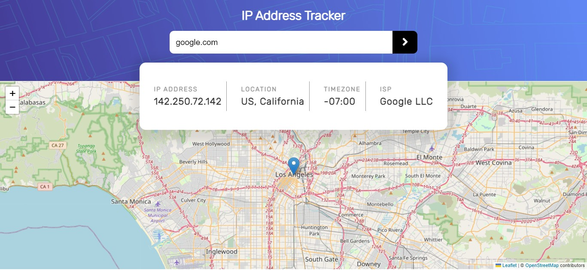

# Frontend Mentor - IP Tracker Solution

This is my solution to the [IP address tracker challenge on Frontend Mentor](https://www.frontendmentor.io/challenges/ip-address-tracker-I8-0yYAH0). Frontend Mentor challenges help you improve your coding skills by building realistic projects.

## Table Of Contents

-  [Overview](#overview)
   -  [The challenge](#the-challenge)
   -  [Screenshot](#screenshot)
   -  [Links](#links)
-  [My Process](#my-process)
   -  [Built With](#built-with)
   -  [What I learned](#what-i-learned)
   -  [Useful Resources](#useful-resources)
-  [Author](#author)

### The challenge

Users should be able to:

-  View the optimal layout for each page depending on their device's screen size
-  See hover states for all interactive elements on the page
-  See their own IP address on the map on the initial page load
-  Search for any IP addresses or domains and see the key information and location

### Screenshot



### Links

-  Solution URL: []()
-  Live Site URL: [IP Address Tracker](https://ip-tracker-react-app.netlify.app/)

## My Process

### Built With

-  Semantic HTML5 markup
-  CSS Custom properties
-  Flexbox
-  CSS Grid
-  Mobile First Workflow
-  [React](https://reactjs.org/)
-  [Styled Components](https://styled-components.com/) - For Styles
-  [react-leaflet](https://react-leaflet.js.org);
-  [leaflet](https://leafletjs.com)

### What I learned

-  One of the major things i learned in this project was how to use the styled components library with React
-  I also learned how to use the leafletjs and react-leaflet library for generating the maps on the website

```js
// STYLED COMPONENTS
const Wrapper = styled.section`
	width: 100vw;
	position: absolute;
	top: 0;
	/* border: 1px solid black; */
	padding: 1.5rem 0;

	.section-center {
		/* border: 1px solid black; */
		display: flex;
		flex-direction: column;
```

### Useful Resources

-  [leaflet](https://leafletjs.com/examples/quick-start/) - This helped me with learning and easily getting started with the leafletjs Library.
-  [react-leaflet examples](https://react-leaflet.js.org/docs/example-popup-marker/) - This helped a lot with writing the code for the map.
-  [react-leaflet video tutorial](https://www.youtube.com/watch?v=290VgjkLong)

## Author

-  Frontend Mentor - [@Multimarix](https://www.frontendmentor.io/profile/Multimarix)
-  Github - [DEE](https://github.com/Di-void)
